# Grid Capture Commander

An enterprise-grade, real-time MMO territory capture game where players compete globally to conquer grid tiles, expand territories, and dominate the leaderboard.

## Overview
Players authenticate into the Commander dashboard and are dropped into a shared, persistent 100x100 global grid. Players can click unowned or enemy-owned tiles to capture them, painting them in their unique faction color. The game features live socket-driven operational logs, real-time leaderboards, and an optimistic rendering engine for 0ms perceived latency.

## Architecture & Data Flow

The system is built on a highly concurrent, horizontally scalable architecture utilizing Node.js, Socket.io, PostgreSQL, and Redis.

```mermaid
sequenceDiagram
    participant Client
    participant Socket Server
    participant Redis Cache
    participant PostgreSQL DB
    
    Client->>Socket Server: Emits 'capture_tile' (x, y)
    
    rect rgb(20, 30, 40)
        Note right of Socket Server: Primary Transaction
        Socket Server->>Redis Cache: Set 3s Cooldown (EX 3)
        Socket Server->>PostgreSQL DB: BEGIN Transaction
        Socket Server->>PostgreSQL DB: SELECT FOR UPDATE (Row Lock)
        Socket Server->>PostgreSQL DB: UPDATE / CREATE Tile
        Socket Server->>PostgreSQL DB: COMMIT
    end
    
    Socket Server-->>Client: Emits 'tile_updated' (Instant Feedback)
    
    rect rgb(20, 40, 30)
        Note right of Socket Server: Background Processing
        Socket Server->>PostgreSQL DB: Async BFS Territory Calculation
        Socket Server->>PostgreSQL DB: Async User Score Increment (+10 / +50)
    end
    
    loop Every 3 Seconds
        Client->>Socket Server: GET /api/leaderboard
        Socket Server->>Redis Cache: Check 'leaderboard:snapshot'
        alt Cache Hit
            Redis Cache-->>Socket Server: Return JSON string
        else Cache Miss
            Socket Server->>PostgreSQL DB: Heavy GroupBy Aggregations
            PostgreSQL DB-->>Socket Server: Return Data
            Socket Server->>Redis Cache: Cache Snapshot (EX 3)
        end
        Socket Server-->>Client: Return Leaderboard Data
    end
```

## Engineering Trade-offs

To guarantee absolute data integrity under massive concurrent load (e.g., 50 players clicking the exact same tile simultaneously) while maintaining extreme performance, several critical architectural trade-offs were made:

### 1. Row-Level Locks (`SELECT FOR UPDATE`) vs. Redis Mutex
**The Decision:** We utilized raw SQL `SELECT ... FOR UPDATE` directly inside Prisma transactions to lock specific tile coordinates. 
**The Trade-off:** While a Redis Distributed Lock might resolve a few milliseconds faster, relying on PostgreSQL row-level locks guarantees ACID compliance and perfectly serialized transactions, completely eliminating race conditions and "double captures" at the database level.

### 2. Asynchronous Territory BFS vs. Synchronous Integrity
**The Decision:** Capturing a tile awards base points (+10), but capturing a contiguous territory of 9+ tiles awards a massive bonus (+50). The Breadth-First-Search (BFS) required to calculate this territory size is expensive.
**The Trade-off:** Instead of forcing the player to wait for the BFS algorithm to finish before confirming their capture, we completely removed the BFS from the critical database transaction. The server instantly emits the `tile_updated` socket event for 0ms perceived UI latency, and processes the heavy territory algorithm entirely in the background. The user's score achieves "eventual consistency" a few milliseconds later.

### 3. Real-Time Leaderboard Polling vs. Event-Driven Broadcasting
**The Decision:** The leaderboard requires massive `GROUP BY` operations across the `tiles` and `capture_history` tables.
**The Trade-off:** Broadcasting a newly recalculated leaderboard over WebSockets on every single tile capture would instantly crash the database under heavy load. Instead, the frontend relies on a 3-second polling mechanism (`setInterval`) hitting an `/api/leaderboard` endpoint protected by a 3-second Redis Cache (`EX 3`). The trade-off is a maximum of 3.0s staleness on the leaderboard, in exchange for a 99.9% reduction in database load.

### 4. Socket.io Redis Adapter vs. In-Memory PubSub
**The Decision:** We implemented `@socket.io/redis-adapter` into the backend cluster.
**The Trade-off:** It adds a slight infrastructure dependency (requiring both Pub and Sub Redis connections), but it inherently solves WebSocket horizontal scaling. If the game goes viral and requires 5 Node.js servers behind a Load Balancer, a capture on Server A is instantly broadcasted to players connected to Server B via Redis Pub/Sub.

## Tech Stack
- **Frontend:** React, Vite, TailwindCSS, Zustand, HTML5 Canvas API
- **Backend:** Node.js, Express, Socket.io
- **Database:** PostgreSQL (Prisma ORM)
- **Caching & Pub/Sub:** Redis
- **Infrastructure Ready:** Vercel (Frontend), Render (Backend), Railway (PostgreSQL)
