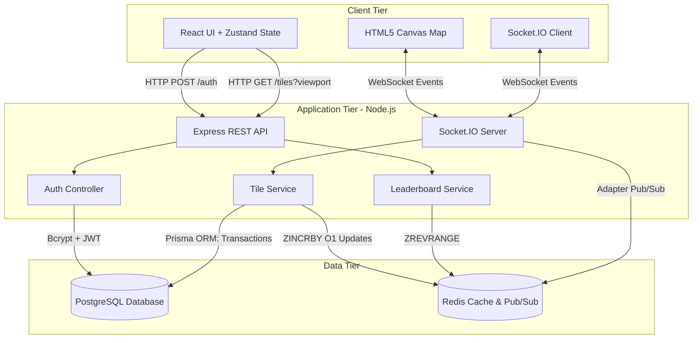
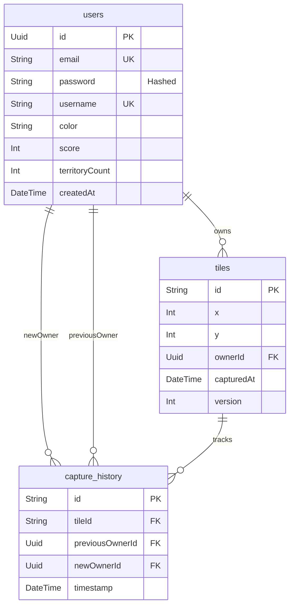

# Grid Capture Commander

An enterprise-grade, real-time MMO territory capture game where players compete globally to conquer grid tiles, expand territories, and dominate the leaderboard.

## Overview
Players authenticate into the Commander dashboard and are dropped into a shared, persistent 100x100 global grid. Players can click unowned or enemy-owned tiles to capture them, painting them in their unique faction color. The game features live socket-driven operational logs, an $O(1)$ real-time Redis leaderboard, and an optimistic rendering engine for 0ms perceived latency.

---

## 🏛 System Architecture & Design

The V2 system is built on a highly concurrent, horizontally scalable architecture utilizing Node.js, Socket.io, PostgreSQL, and Redis. It enforces a strict Controller-Service-Repository pattern for enterprise maintainability.

---

## 🗄 Entity Relationship (ER) Diagram

The persistent data model relies on a highly normalized PostgreSQL relational database. 

---

## 🚀 Data Flow & Engineering Trade-offs

To guarantee absolute data integrity under massive concurrent load (e.g., 50 players clicking the exact same tile simultaneously) while maintaining extreme performance, several critical architectural implementations were built.

### 1. Viewport-Based Rendering & Fetching
Instead of loading the massive 10,000+ tile array synchronously, the client sends `startX`, `startY`, `endX`, and `endY` bounds. The backend executes bounded database queries to fetch only what is strictly visible on the screen.

### 2. $O(1)$ Real-Time Redis Leaderboard
Calculating the global leaderboard using massive PostgreSQL `GROUP BY` operations is notoriously slow. 
**The V2 Solution:** Every time a tile is captured, the backend fires an asynchronous `ZINCRBY leaderboard +10 <userId>` command directly into Redis. The leaderboard is mathematically updated in $O(1)$ time complexity, completely bypassing the relational database and enabling true sub-millisecond, real-time leaderboard polling without crashing the server.

### 3. Asynchronous Territory BFS vs. Synchronous Integrity
Capturing a contiguous territory of tiles triggers a massive Breadth-First-Search (BFS) algorithm to calculate contiguous area size.
**The Trade-off:** Instead of forcing the player to wait for the BFS algorithm to finish before confirming their capture, we completely removed the BFS from the critical database transaction. The server instantly emits the `tile_updated` socket event for 0ms perceived UI latency, and processes the heavy territory algorithm entirely in the background. 

### 4. Row-Level Locks (`SELECT FOR UPDATE`)
We utilize raw SQL `SELECT ... FOR UPDATE` directly inside Prisma transactions to lock specific tile coordinates. While a Redis Distributed Lock might resolve a few milliseconds faster, relying on PostgreSQL row-level locks guarantees ACID compliance and perfectly serialized transactions, completely eliminating race conditions and "double captures" at the database level.

### 5. Secure Email/Password Authentication
The system uses `bcryptjs` for cryptographic password hashing and signs stateless JSON Web Tokens (`JWT`) to authorize Socket.io connections before establishing a handshake, effectively mitigating unauthorized packet spoofing.

---

## 💻 Tech Stack
- **Frontend:** React, Vite, TailwindCSS, Zustand, HTML5 Canvas API
- **Backend:** Node.js, Express, Socket.io, JWT, bcrypt
- **Database:** PostgreSQL (Prisma ORM)
- **Caching & Pub/Sub:** Redis
